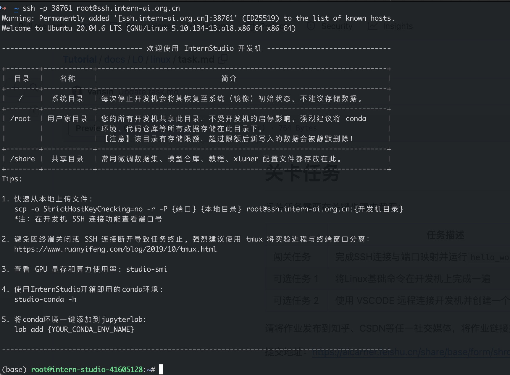
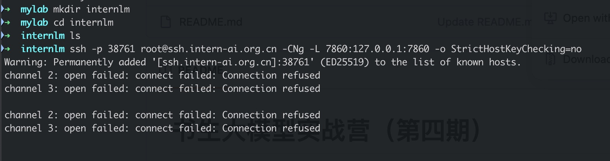
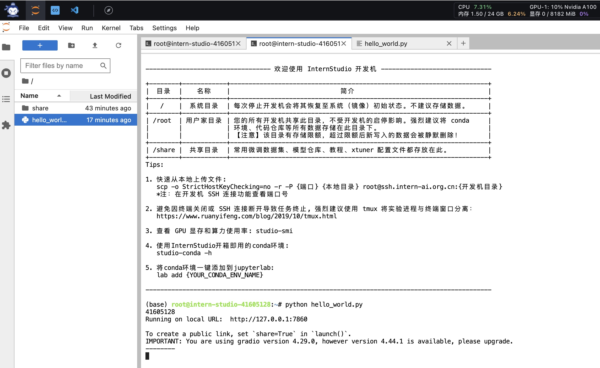
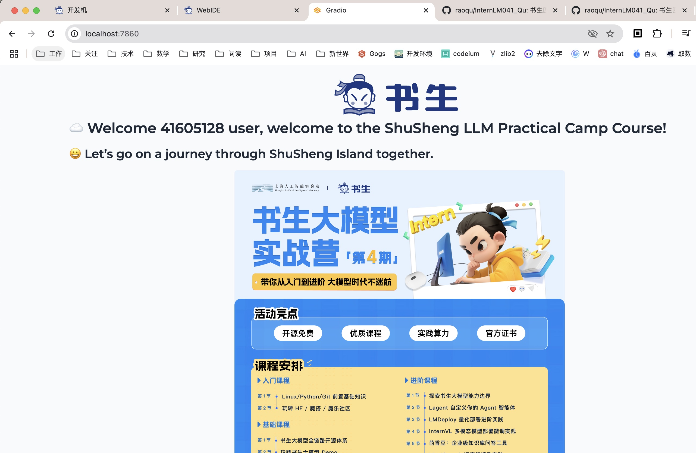
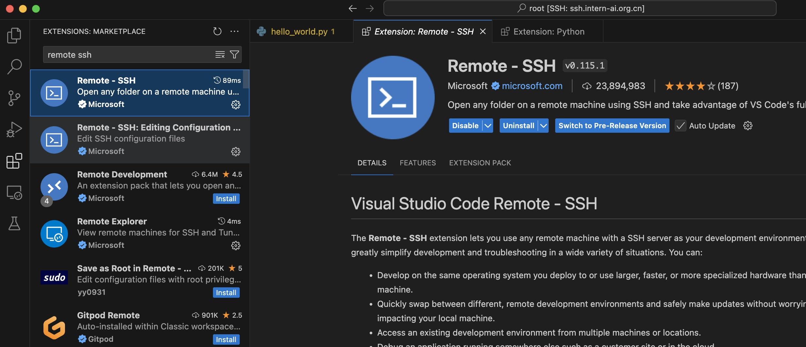
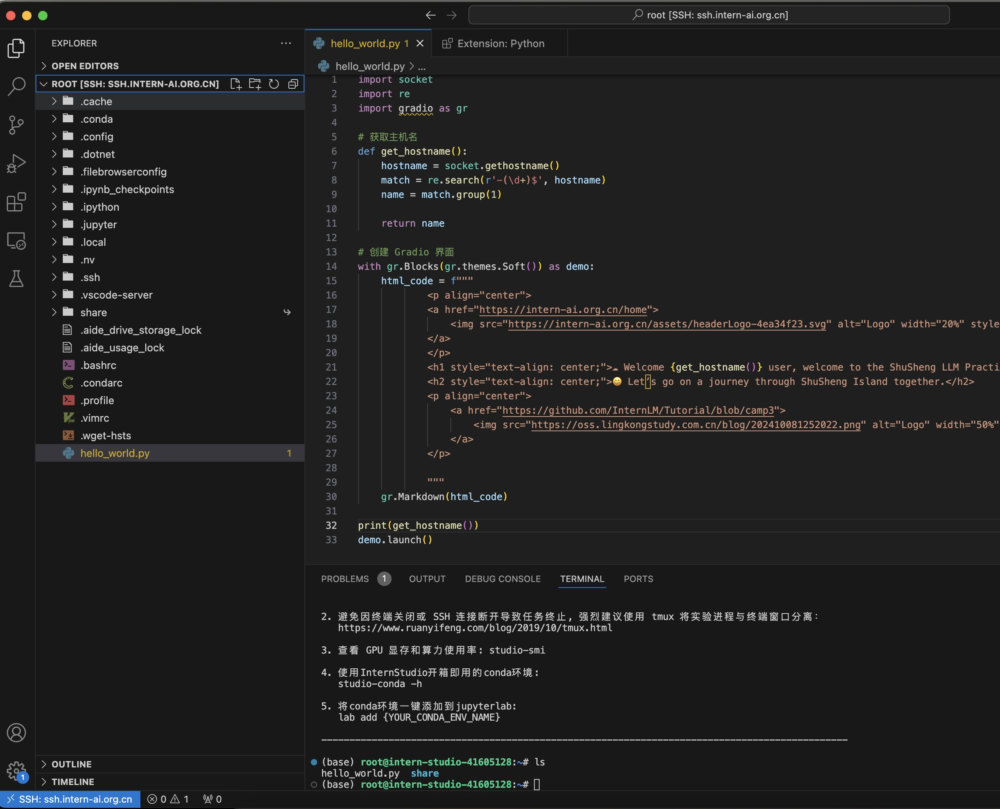

# Linux 前置基础

## 1. 环境配置

首先在 [InternStudio](https://studio.intern-ai.org.cn/) 控制台创建开发机

## 2. SSH 连接与端口映射

1. 通过 ssh-keygen 生成公钥
2. 在 InternStudio 中配置生成的 ssh 公钥
3. 通过 ssh 连接到开发机

4. 通过 ssh命令创建端口映射：

`ssh -p 38761 root@ssh.intern-ai.org.cn -CNg -L 7860:127.0.0.1:7860 -o StrictHostKeyChecking=no`

## 3. Python

1. 通过开发机的“进入开发机”入口，连接到开发环境
2. 创建 hello_world.py，从文档中复制 python 源码
3. 开发机已经默认配置了conda环境，`pip install gradio==4.29.0` 安装gradio
4. `python hello_world.py` 运行python代码（也可以在ssh中运行）

5. 通过浏览器访问 http://127.0.0.1:7860 

## 4. VSCode 安装SSH插件

1. 在 VSCode 中安装 Remote SSH 插件

2. 通过 Remote SSH 插件配置SSH连接
3. 通过插件连接开发机，并打开远端开发目录

