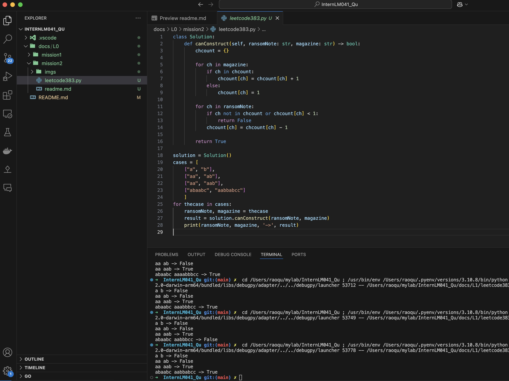
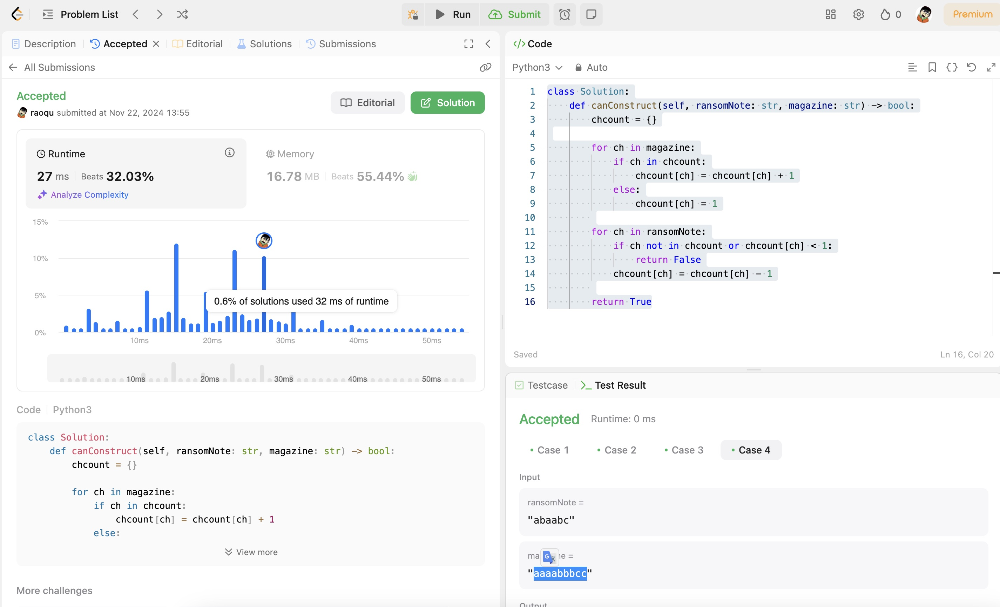
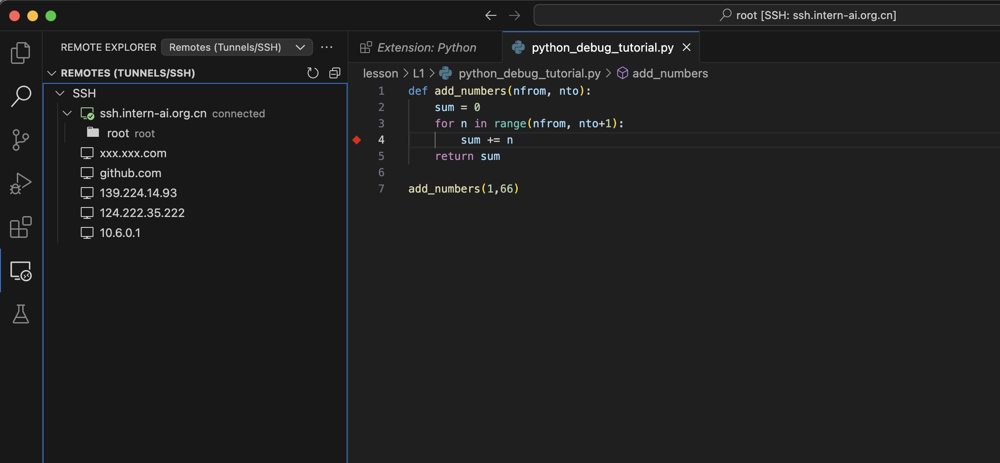
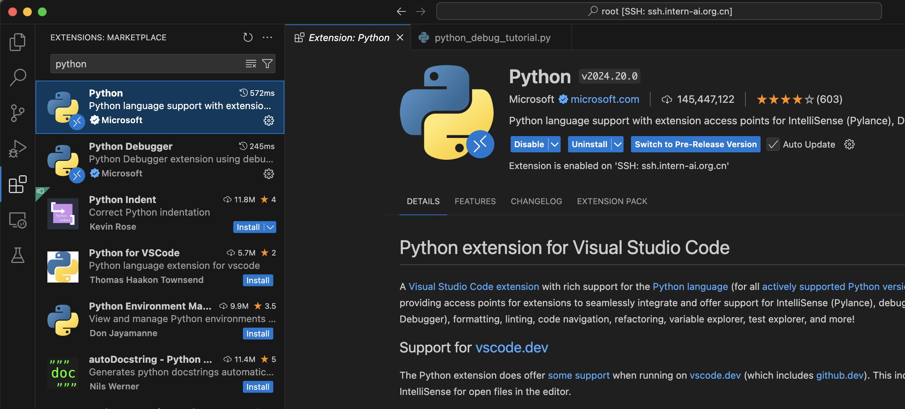
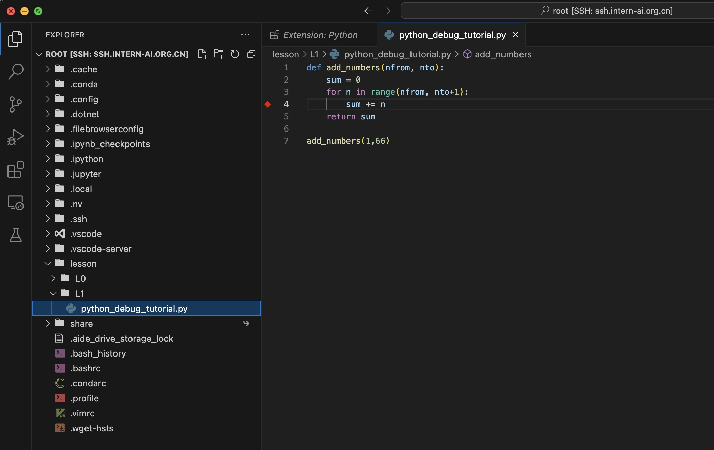
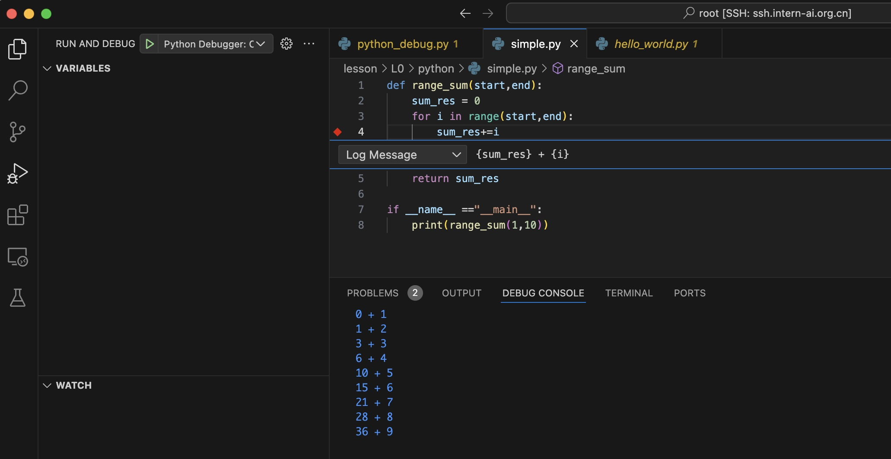
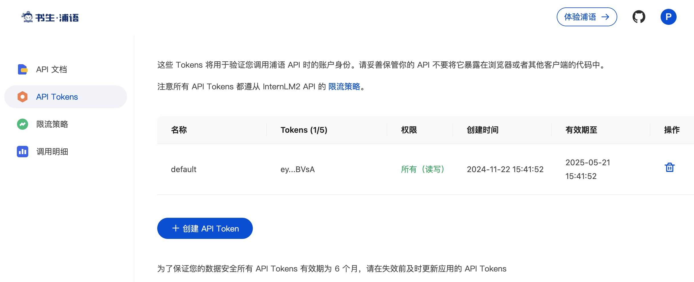
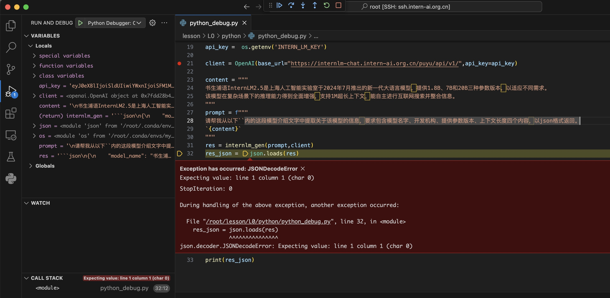
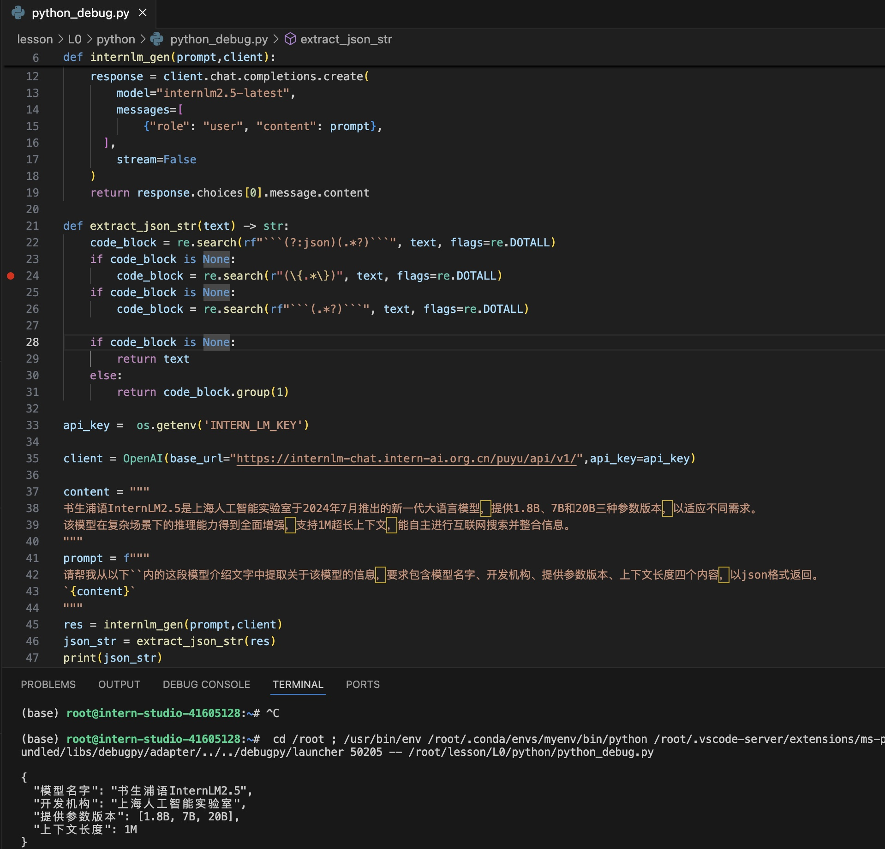

# 1. 任务一：Leetcode 383

leetcode 383 代码：

```python
class Solution:
    def canConstruct(self, ransomNote: str, magazine: str) -> bool:
        chcount = {}

        for ch in magazine:
            if ch in chcount:
                chcount[ch] = chcount[ch] + 1
            else:
                chcount[ch] = 1
        
        for ch in ransomNote:
            if ch not in chcount or chcount[ch] < 1:
                return False
            chcount[ch] = chcount[ch] - 1
        
        return True

solution = Solution()
cases = [
    ["a", "b"],
    ["aa", "ab"],
    ["aa", "aab"],
    ["abaabc", "aabbabcc"]
    ]
for thecase in cases:
    ransomNote, magazine = thecase
    result = solution.canConstruct(ransomNote, magazine)
    print(ransomNote, magazine, '->', result)

```
本地vscode输出结果：



leetcode 提交：



# 任务二：Vscode 连接 InternStudio debug

1. vscode 安装 remote ssh 插件



2. vscode通过ssh远程InternSutdio，安装python插件





远程调试验证（debug message）



# 3. Debug 代码

1. 创建python文件，复制待调试的LM代码
2. 创建书生浦语 API token



3. 修改代码并设置API token环境变量 `export INTERN_API_KEY='...'`
4. 调试并修正代码

    1. 安装openai依赖 `pip install openai`
    2. 通过调试发现代码执行异常



    3. 错误原因是LLM返回的结果中包含json之外的内容，因此需要特殊处理
    
    4. 修正代码与输出结果



5. 修改正确后的代码：


```python
from openai import OpenAI
import os
import json
import re

def internlm_gen(prompt,client):
    '''
    LLM生成函数
    Param prompt: prompt string
    Param client: OpenAI client 
    '''
    response = client.chat.completions.create(
        model="internlm2.5-latest",
        messages=[
            {"role": "user", "content": prompt},
      ],
        stream=False
    )
    return response.choices[0].message.content

def extract_json_str(text) -> str:
    code_block = re.search(rf"```(?:json)(.*?)```", text, flags=re.DOTALL)
    if code_block is None:
        code_block = re.search(r"(\{.*\})", text, flags=re.DOTALL)
    if code_block is None:
        code_block = re.search(rf"```(.*?)```", text, flags=re.DOTALL)

    if code_block is None:
        return text 
    else:
        return code_block.group(1)

api_key =  os.getenv('INTERN_LM_KEY')

client = OpenAI(base_url="https://internlm-chat.intern-ai.org.cn/puyu/api/v1/",api_key=api_key)

content = """
书生浦语InternLM2.5是上海人工智能实验室于2024年7月推出的新一代大语言模型，提供1.8B、7B和20B三种参数版本，以适应不同需求。
该模型在复杂场景下的推理能力得到全面增强，支持1M超长上下文，能自主进行互联网搜索并整合信息。
"""
prompt = f"""
请帮我从以下``内的这段模型介绍文字中提取关于该模型的信息，要求包含模型名字、开发机构、提供参数版本、上下文长度四个内容，以json格式返回。
`{content}`
"""
res = internlm_gen(prompt,client)
json_str = extract_json_str(res)
print(json_str)
```