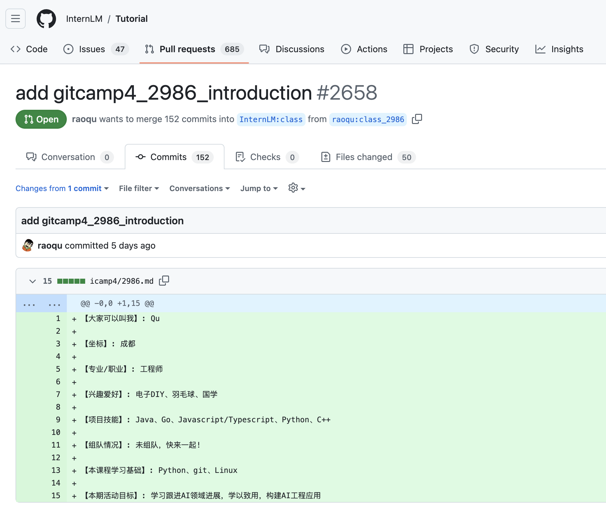
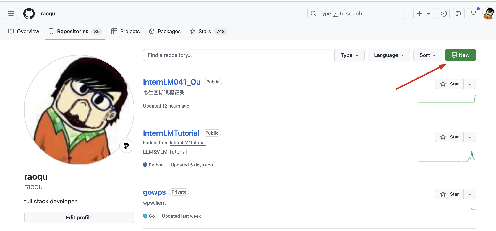

# 任务1. 破冰活动：自我介绍

1. 首先从 InternLM git仓库 fork 到[自己的仓库](https://github.com/raoqu/InternLMTutorial)，需要注意同步所有分支（我们需要的是class分支）
2. git clone 到本地
```
git clone git@github.com:raoqu/InternLMTutorial.git
```
3. git checkout，并创建自己的本地分支
4. git commit、push，然后在github上创建 Pull Request（注意目标选择class分支）




自我介绍 Pull Request: https://github.com/InternLM/Tutorial/pull/2658/commits/bc73b2f818fd5ed0c51def95ab5a050a1a217c88

# 任务2. 实践项目：构建个人项目

1. 在github 上创建自己的Github 仓库

Github仓库： https://github.com/raoqu/InternLM041_Qu



2. git clone https://github.com/raoqu/InternLM041_Qu 到本地
3. 本地创建、编辑文件，git commit 提交
4. git push同步 到github

