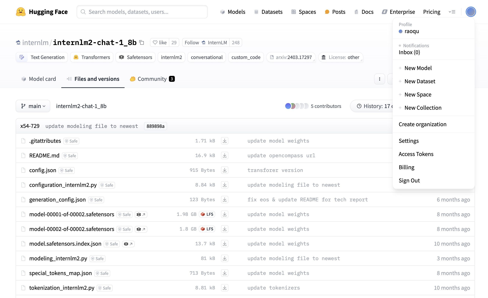
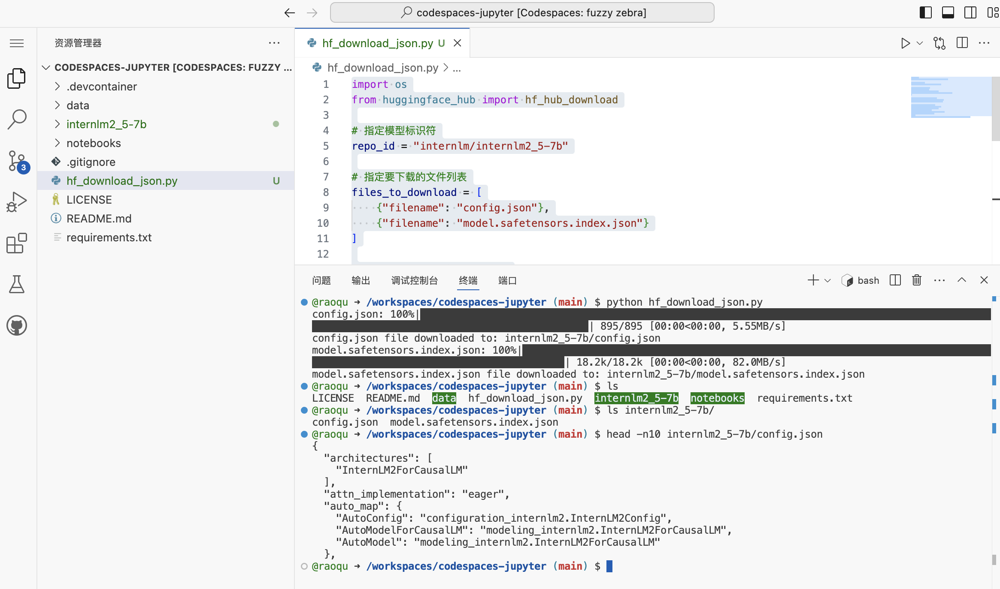
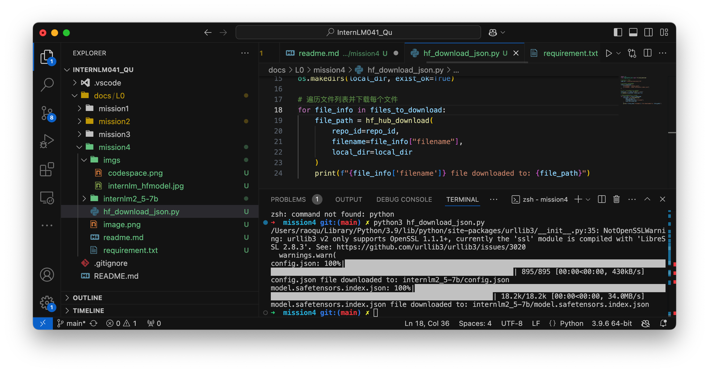
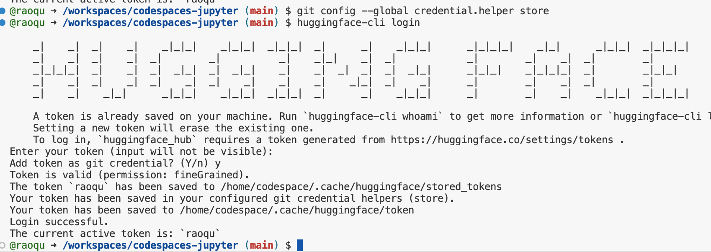
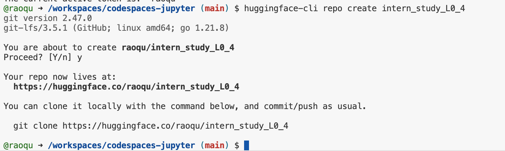
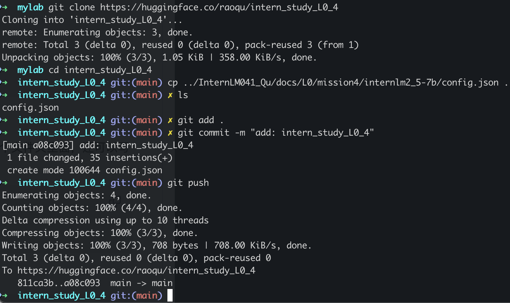
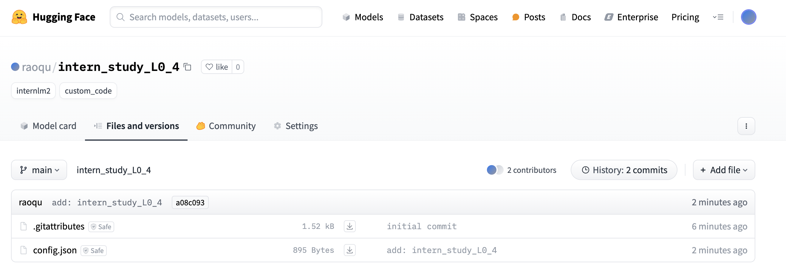
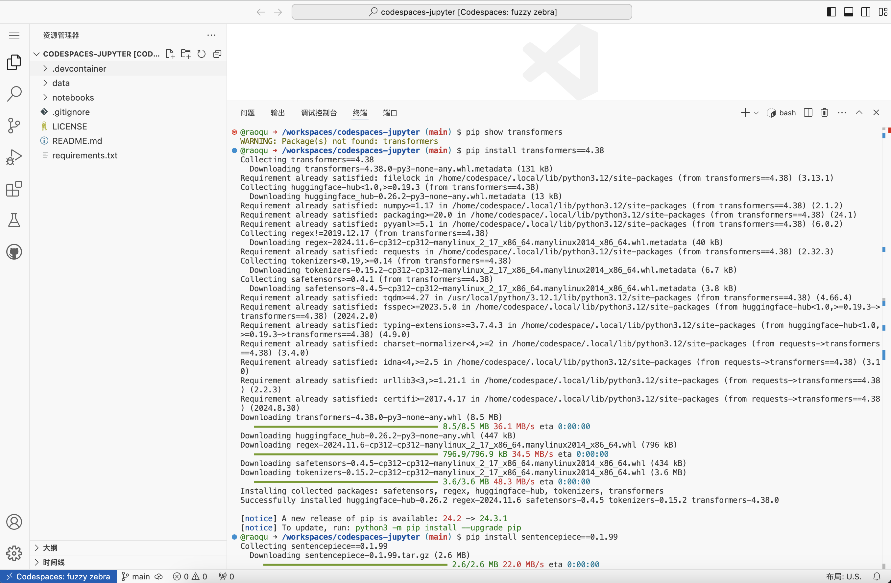

# 任务1. 模型下载

1. 注册hugging face（已有账号）
2. 访问模型地址：https://huggingface.co/internlm/internlm2-chat-1_8b/tree/main


3. 通过Github Codespace下载模型

    1. 访问 [Github Codespace](https://github.com/codespaces)
    2. 访问 Codespace Jupyther Notebook
    3. 根据文档创建 hf_download_json.py 文件
    4. 安装必要的 pip 依赖
    5. 执行 hf_download_json.py，查看 internlm2_5-7b 目录，确认模型已下载（配置文件）


4. 本地下载模型（同第3项，本地环境先解决网络问题）


# 任务2. 模型上传

1. 在inter_cobuild项目实践过程中，`pip install huggingface_hub`
2. hugingface-cli loign



3. 创建 intern_study_L0_4 仓库


4. 克隆到本地，添加此前已下载的config.json，git 提交上传
```
git clone https://huggingface.co/raoqu/intern_study_L0_4
cp ../InternLM041_Qu/docs/L0/mission4/internlm2_5-7b/config.json .
git add .
git commit -m "add: intern_study_L0_4"
git push
```



5. 检查文件上传结果到 [raoqu/intern_study_L0_4](https://huggingface.co/raoqu/intern_study_L0_4/tree/main)



# 任务3. Space上传

1. 进入[Codespace](https://github.com/codespaces)
2. 安装必要的依赖
