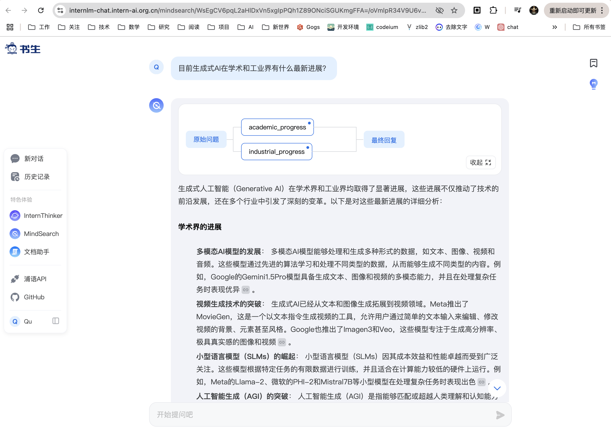
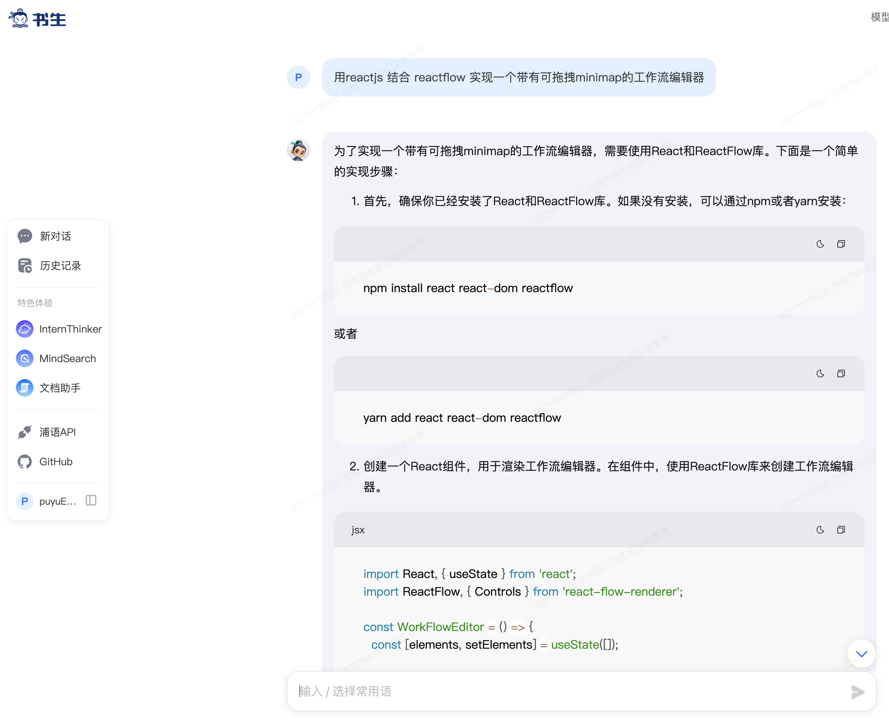
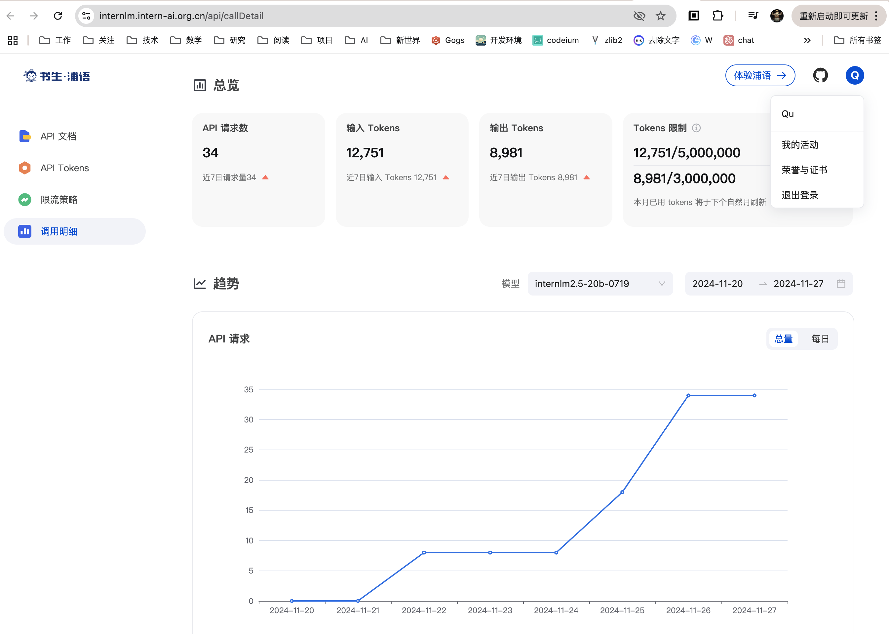
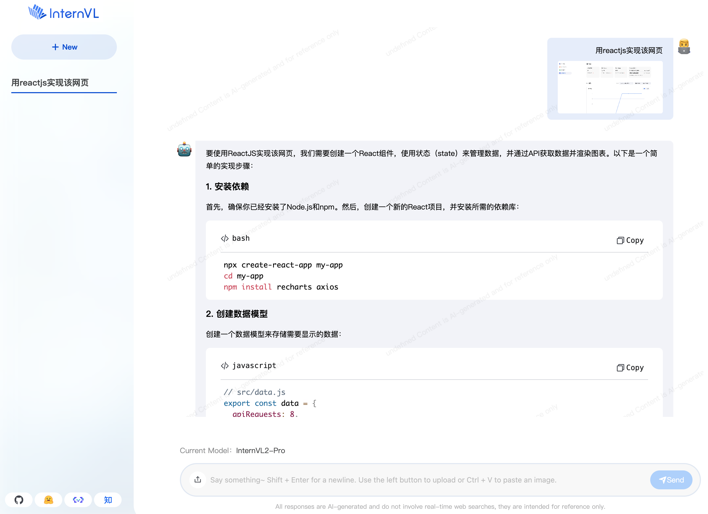
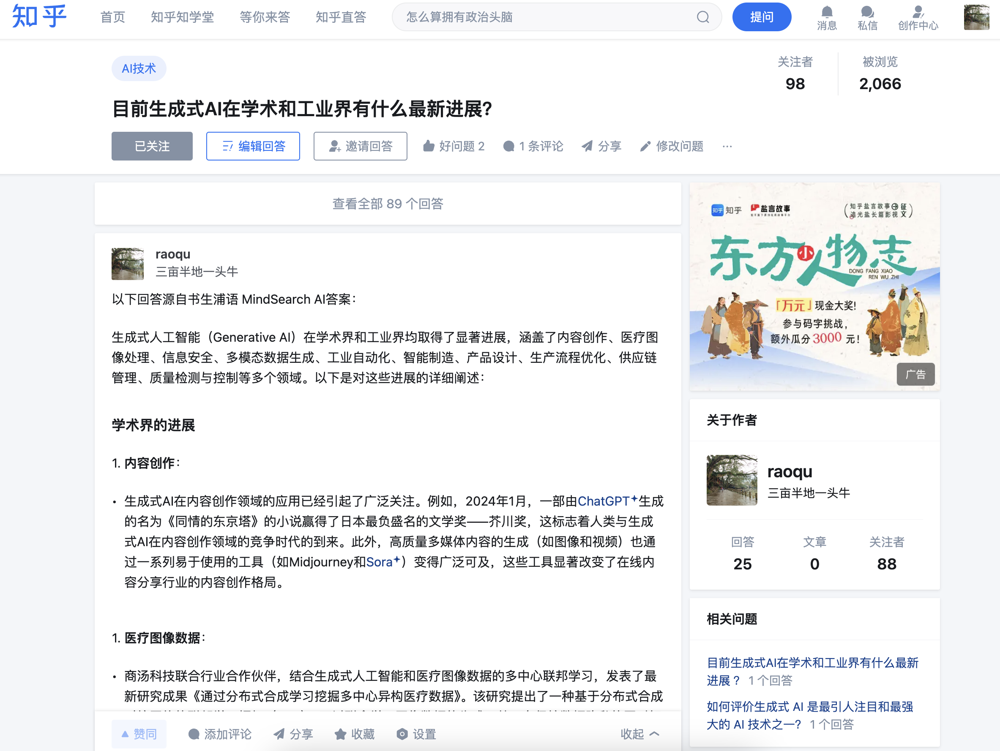
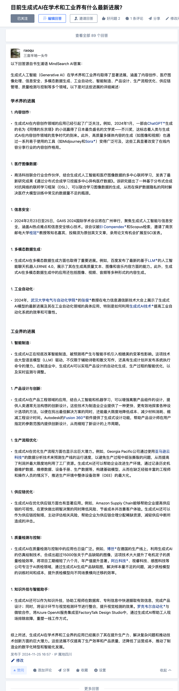

# 基础任务

# MindSearch

让MindSearch回答生成式AI在学术和工业界的最新进展：

# 书生浦语

通过书生浦语实现前端代码的coding工作：

# 书生万象

对书生浦语API使用情况截图，让书生万象进行理解

书生万象正确解析了网页截图内容

# 进阶任务

使用书生浦语MindSearch AI回答知乎问题

知乎链接： https://www.zhihu.com/question/1841339763/answer/40399546990

