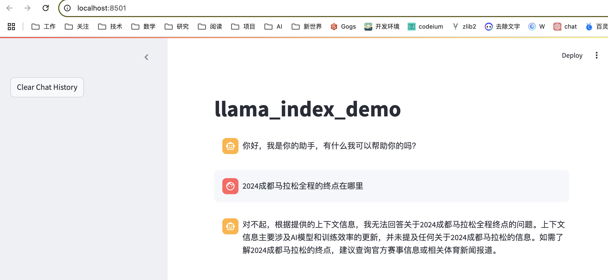
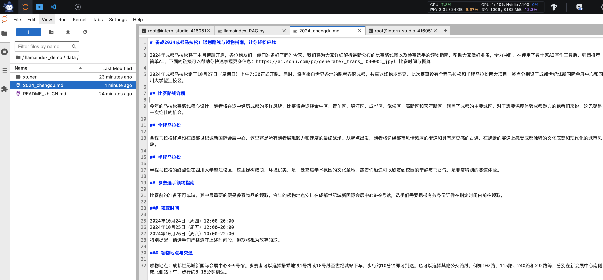
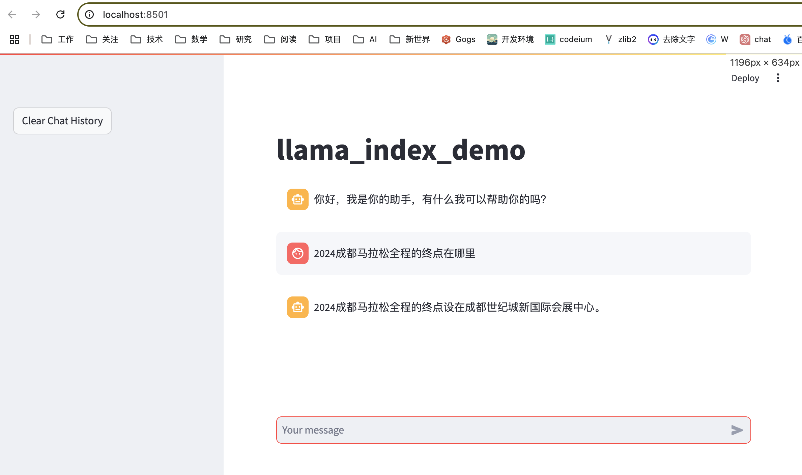
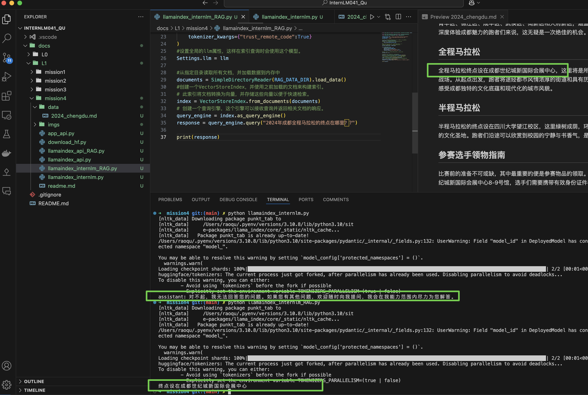

# 任务要求1：使用API实现RAG

## API调用

1. 按照文档编写代码 `app.py`
1. 按照文档执行 `streamlit run app.py`
2. 按照前期课程将Interlm开发机的端口映射到本地端口
```
ssh -p 40805 root@ssh.intern-ai.org.cn -CNg -L 8501:127.0.0.1:8501 -o StrictHostKeyChecking=no
```



## RAG

1. 添加文档 `llamaindex_demo/data/2024_chengdu.md`



2. 重新运行streamlit



## 任务要求2：使用本地InternLM2-Chat-1.8B模型实现RAG



# Streamlit + LlamaIndex + 浦语API Space部署

https://huggingface.co/spaces/raoqu/internlm2_rag/tree/main
