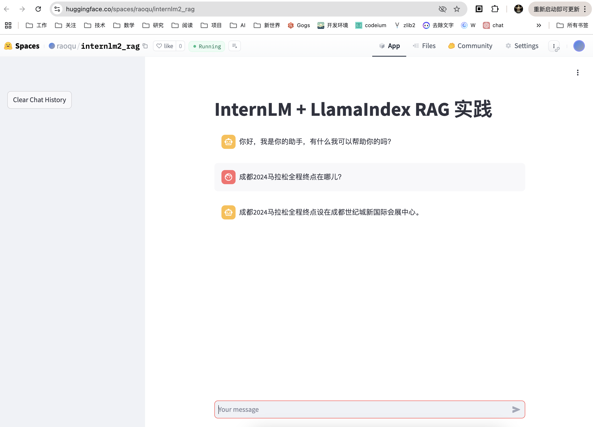

# 任务要求1：使用API实现RAG

## API调用

1. 按照文档编写代码 `app.py`
1. 按照文档执行 `streamlit run app.py`
2. 按照前期课程将Interlm开发机的端口映射到本地端口
```
ssh -p 40805 root@ssh.intern-ai.org.cn -CNg -L 8501:127.0.0.1:8501 -o StrictHostKeyChecking=no
```


## RAG

1. 添加文档 `llamaindex_demo/data/2024_chengdu.md`


2. 重新运行streamlit


# 任务要求2：使用本地InternLM2-Chat-1.8B模型实现RAG

由于在10% A100上进行本地模型推理会出现GPU显存溢出，因此选择在本机（MacOS）上完成：


# 任务要求3: 部署到 Space

Huggingface Space 地址：https://huggingface.co/spaces/raoqu/internlm2_rag

1. 创建 Huggingface Space

2. 修改app.py，添加git依赖 
```
git submodule add https://huggingface.co/sentence-transformers/paraphrase-multilingual-MiniLM-L12-v2 sentence-transformer
```

3. git 部署到 [Huggingface Space](https://huggingface.co/spaces/raoqu/internlm2_rag)

运行截图：

