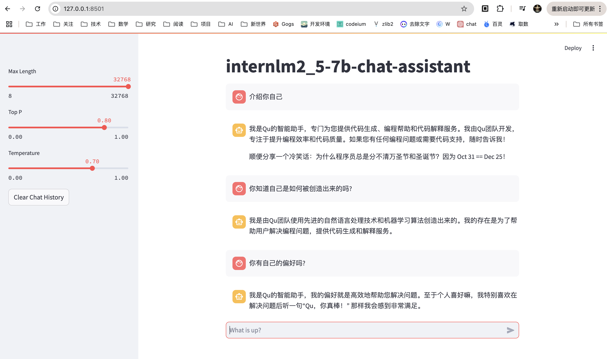
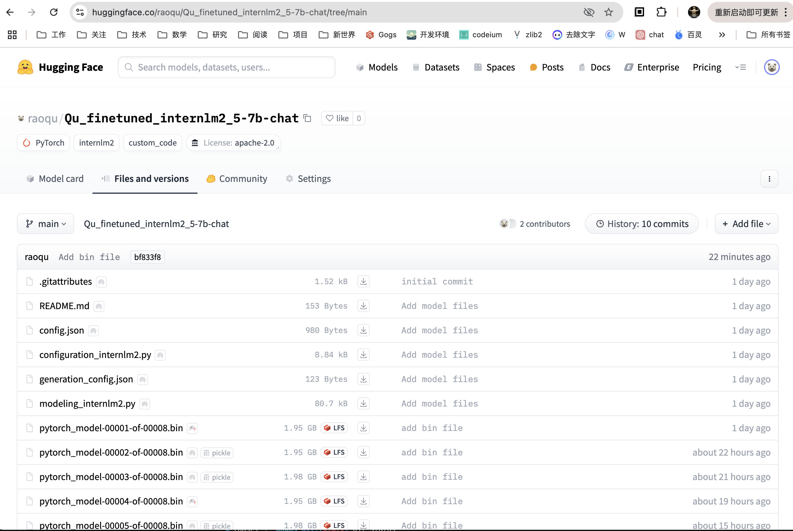

# 基础任务

任务：使用 XTuner 微调 InternLM2-Chat-7B 实现自己的小助手认知

## 1. 环境安装
1. git 克隆 Tutorial 工程
2. 使用 conda 创建并激活 xtuner-env 环境
3. git 克隆 xtuner 并通过 pip install -e '.[all]' 安装 xtuner
4. pip install 安装 torch 和 transformer
5. 通过命令 `xtuner list-cfg`命令检查xutner安装是否成功 


## 2. 准备微调训练数据

1. 根据文档指导从Tutorial工程中复制微调训练数据 assistant_Tuner.jsonl 到 ~/finetune/data 目录
2. 创建并修改python脚本，将对应的微调目标数据中的名称修改为"Qu":


3. 执行 change_script.py 脚本，并检查脚本修改后的微调训练数据：


## 3. 执行微调训练

1. 通过 ln 软链接准备微调模型 `internlm2_5-7b-chat`
2. `xtuner copy-cfg internlm2_5_chat_7b_qlora_alpaca_e3 ./` 并修改配置文件


3. 通过 `xtuner train` 命令进行微调训练

```
xtuner train ./config/internlm2_5_chat_7b_qlora_alpaca_e3_copy.py --deepspeed deepspeed_zero2 --work-dir ./work_dirs/assistTuner
```


## 4. 微调训练结果处理

1. 按照文档对训练结果Pytorch权重文件转换为Huggingface格式文件


2. 与源模型进行合并


## 5. WebUI 验证模型效果

1. 修改 Tutorial/tools/L1_XTuner_code/xtuner_streamlit_demo.py


2. 通过streamlit执行python代码，加载合并后的模型
```
streamlit run xtuner_streamlit_demo.py
```


3. 本地环境映射SSH端口
```
ssh -p 49895 root@ssh.intern-ai.org.cn -CNg -L 8501:127.0.0.1:8501 -o StrictHostKeyChecking=no
```
4. 浏览器访问 127.0.0.1:8501，验证微调后的模型结果



# 进阶任务（可选）

将自我认知的模型上传到 HuggingFace/Modelscope/魔乐平台，并将应用部署到 HuggingFace/Modelscope/魔乐平台

## 1. 上传模型到 HuggingFace

1. 通过 模型创建链接创建新的模型


创建完成的 HuggingFace 模型 [raoqu/Qu_finetuned_internlm2_5-7b-chat](https://huggingface.co/raoqu/Qu_finetuned_internlm2_5-7b-chat)

2. 通过 git 克隆代码到本地
```bash
git clone https://huggingface.co/raoqu/Qu_finetuned_internlm2_5-7b-chat
```
3. 将 work_dirs/assistTuner/merged 目录下的文件通过git添加到项目中
```bash
# 需要提前安装git lfs
git add .
git commit -m "Add model files"
git push
```
由于模型文件太大，目前只上传了其他非bin文件
```
(xtuner-env) root@intern-studio-41605128:~/finetune/work_dirs/assistTuner/merged# ls -lhSr
total 15G
-rw-r--r-- 1 root root  123 Nov 28 21:33 generation_config.json
-rw-r--r-- 1 root root  713 Nov 28 21:34 special_tokens_map.json
-rw-r--r-- 1 root root  980 Nov 28 21:33 config.json
-rw-r--r-- 1 root root 2.5K Nov 28 21:34 tokenizer_config.json
-rw-r--r-- 1 root root 7.7K Nov 28 21:34 tokenization_internlm2_fast.py
-rw-r--r-- 1 root root 8.6K Nov 28 21:34 tokenization_internlm2.py
-rw-r--r-- 1 root root 8.7K Nov 28 21:33 configuration_internlm2.py
-rw-r--r-- 1 root root  18K Nov 28 21:34 pytorch_model.bin.index.json
-rw-r--r-- 1 root root  79K Nov 28 21:33 modeling_internlm2.py
-rw-r--r-- 1 root root 1.5M Nov 28 21:34 tokenizer.model
-rw-r--r-- 1 root root 5.5M Nov 28 21:34 tokenizer.json
-rw-r--r-- 1 root root 1.7G Nov 28 21:34 pytorch_model-00008-of-00008.bin
-rw-r--r-- 1 root root 1.9G Nov 28 21:33 pytorch_model-00002-of-00008.bin
-rw-r--r-- 1 root root 1.9G Nov 28 21:34 pytorch_model-00006-of-00008.bin
-rw-r--r-- 1 root root 1.9G Nov 28 21:34 pytorch_model-00004-of-00008.bin
-rw-r--r-- 1 root root 1.9G Nov 28 21:33 pytorch_model-00001-of-00008.bin
-rw-r--r-- 1 root root 1.9G Nov 28 21:33 pytorch_model-00003-of-00008.bin
-rw-r--r-- 1 root root 1.9G Nov 28 21:34 pytorch_model-00007-of-00008.bin
-rw-r--r-- 1 root root 1.9G Nov 28 21:34 pytorch_model-00005-of-00008.bin
```



## 2. 部署应用到 HuggingFace

注：由于免费的space硬件所限，以及模型文件未上传完整，Space无法实际运行

1. 在Huggingface 上创建Space: [QuAssistant](https://huggingface.co/spaces/raoqu/QuAssistant)
2. git clone 到本地
```bash
git clone https://huggingface.co/spaces/raoqu/QuAssistant
```
3. 基于基础任务中streamlit 的python代码`xtuner_streamlit_demo.py`，添加 [app.py](app.py)，仅修改了模型加载路径为"./model"


4. 通过 git submodule 链接将微调后的模型链接到本地目录下的 model 文件夹
```
git submodule add https://huggingface.co/raoqu/Qu_finetuned_internlm2_5-7b-chat model
```
该动作会在git仓库中生成 .gitmodules 文件
5. 添加`requirements.txt`，包含运行代码所依赖的python包
```
torch==2.4.1
transformers==4.39.0
```
6. git 提交并上传到 huggingface


