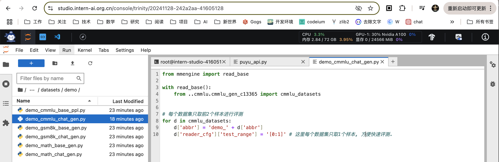

> OpenCompaas 评测 InternLM-1.8B 实践

# 基础任务

## 1. 浦语API评测

### 1.1 环境配置
1. 创建书生浦语 API Token，设置到linux环境变量

2. git 下载 opencompass 代码，安装python包及依赖
```
cd ~
git clone -b 0.3.3 https://github.com/open-compass/opencompass
cd ~/opencompass
conda create -n opencompass python=3.10
conda activate opencompass
pip install -e .
pip install -r requirements.txt
pip install huggingface_hub==0.25.2
```
### 1.2 准备API调用及数据集
3. 创建python代码声明API `puyu_api.py`

4. 修改python代码声明数据集 `demo_cmmlu_chat_gen.py`（修改为每个数据集只取1个样本）

按照视频指引删除重复的 demo_cmmlu_chat_gen.py



### 1.3 执行评测脚本

```shell
export INTERN_LM_KEY='...'
python run.py --models puyu_api.py --datasets demo_cmmlu_chat_gen.py --debug
```
过程中需要解决包依赖的问题
```
pip insstall importlib_metadata
pip install py-rouge
```


6. 查看评测结果
```
cat /root/opencompass/outputs/default/20241129_122924/summary/summary_20241129_122924.txt
```


## 2. internlm2.5-chat-1.8b 本地模型在 ceval数据集上进行评测

### 2.1 环境配置
1. 按照文档指引安装python依赖的pip包及 cmake
```
git clone -b 0.3.3 https://github.com/open-compass/opencompass
cd /root/opencompass
conda create -n opencompass python=3.10
conda activate opencompass
conda install pytorch==2.1.2 torchvision==0.16.2 torchaudio==2.1.2 pytorch-cuda=12.1 -c pytorch -c nvidia -y
apt-get update
apt-get install cmake
pip install protobuf==4.25.3
pip install huggingface-hub==0.23.2
```
### 2.2 准备数据集
下载数据集并解压
```shell
cp /share/temp/datasets/OpenCompassData-core-20231110.zip /root/opencompass/
unzip OpenCompassData-core-20231110.zip
```
列出InternLM和C-Eval相关配置
```
python tools/list_configs.py internlm ceval
```


### 2.3 修改评测脚本

修改 [hf_internlm2_5_1_8b_chat.py](hf_internlm2_5_1_8b_chat.py)，注意有两个文件，可以修改成相同，或是删除一个


### 2.4 执行评测

由于评测时间较长，为了确保评测期间开发机不会被中断，先停止一次，重新开启设置较长的时间

执行评测脚本
```shell
conda activate opencompass
cd ~/opencompass
python run.py --datasets ceval_gen --models hf_internlm2_5_1_8b_chat --debug
```

过程中解决 pip 包依赖版本问题
```
pip install importlib_metadata
pip install py_rouge
# 降低numpy版本
pip install numpy==1.26.3
# 安装缺失的包
pip install onnxscript
# 降低 transformer 版本
pip install transformers==4.39.3
```

重新执行评测命令，等等评测结果完成
```
python run.py --datasets ceval_gen --models hf_internlm2_5_1_8b_chat --debug
```


