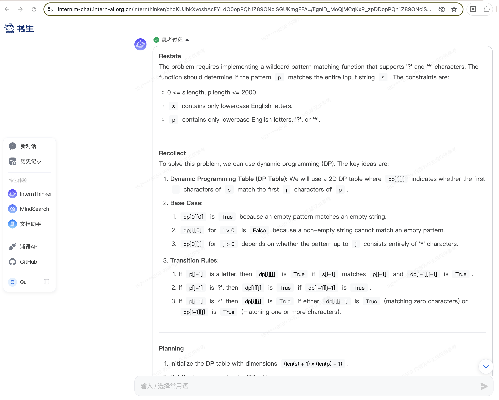
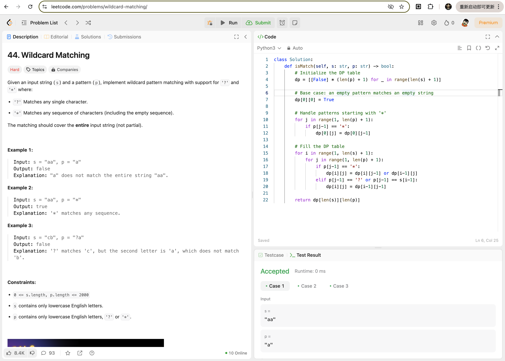
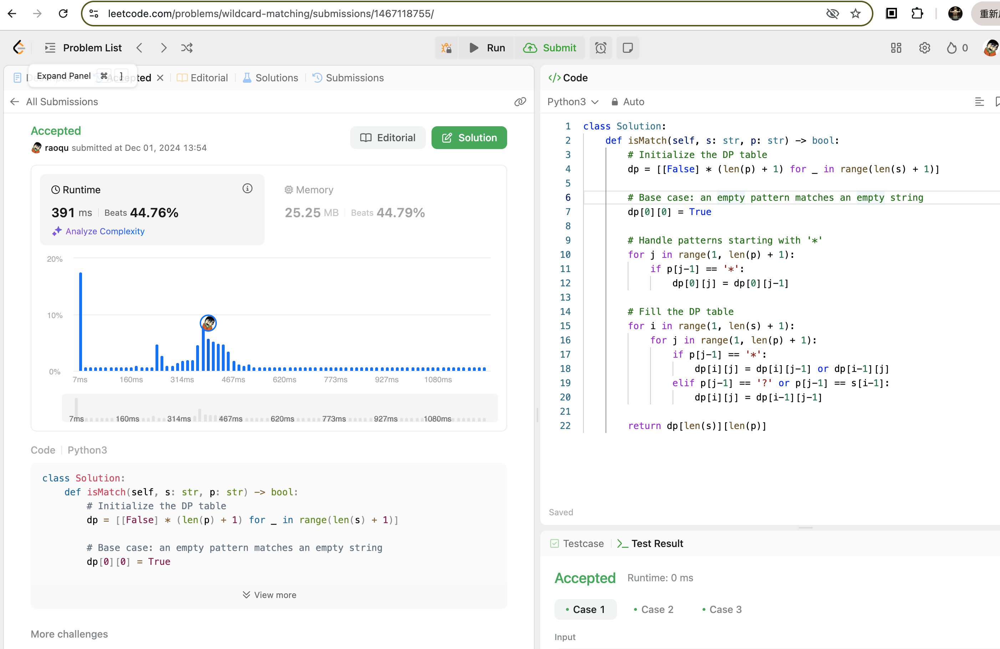
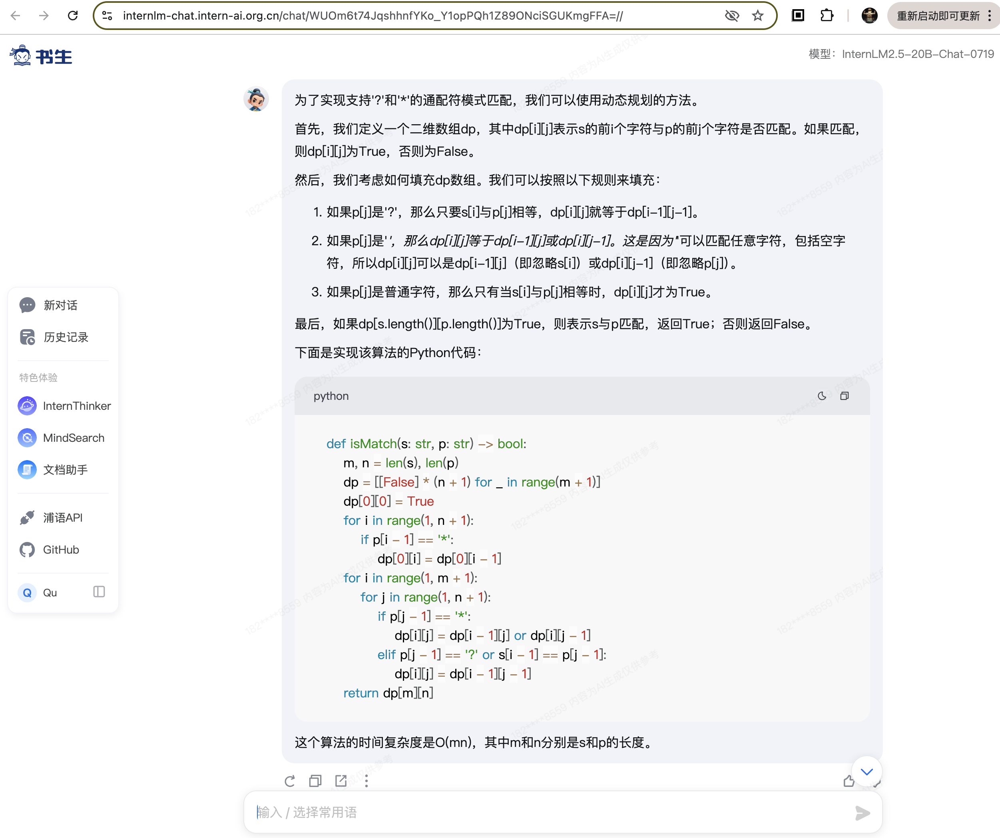
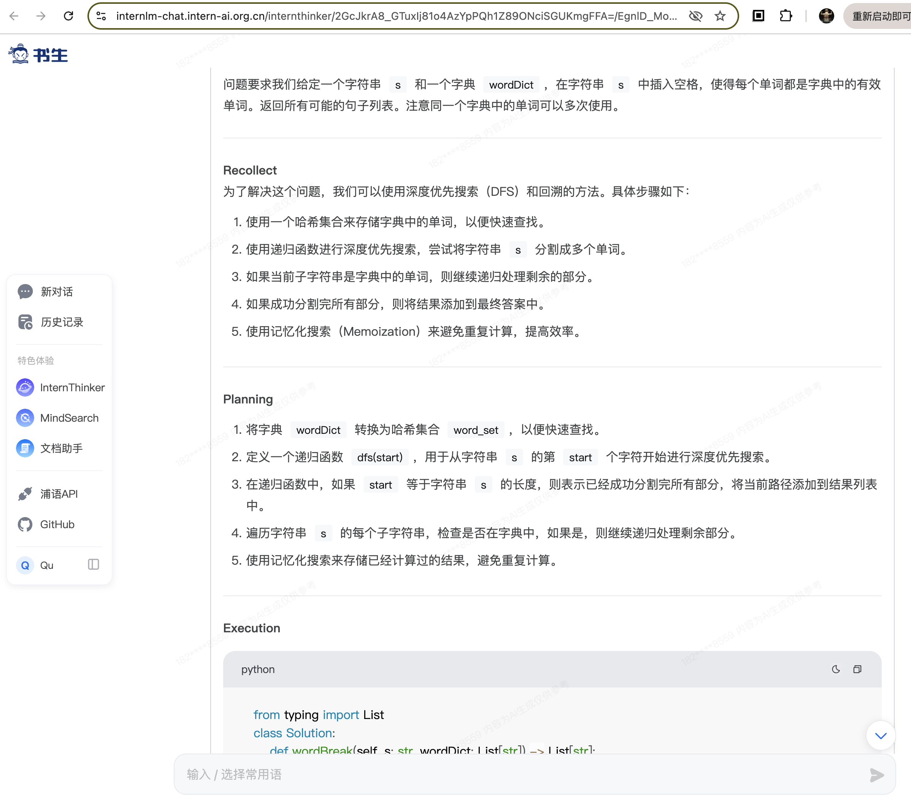
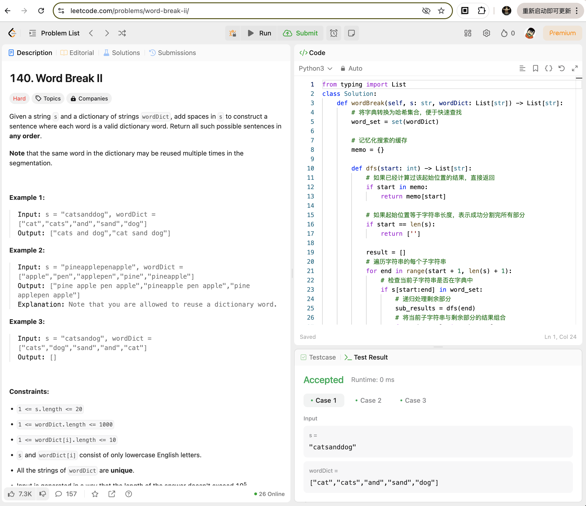
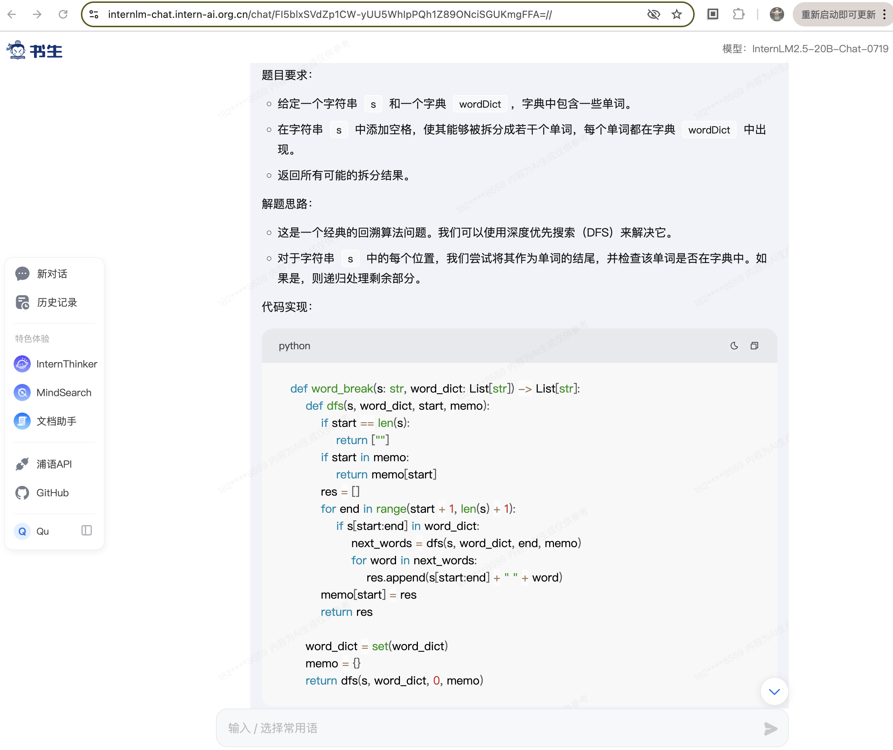
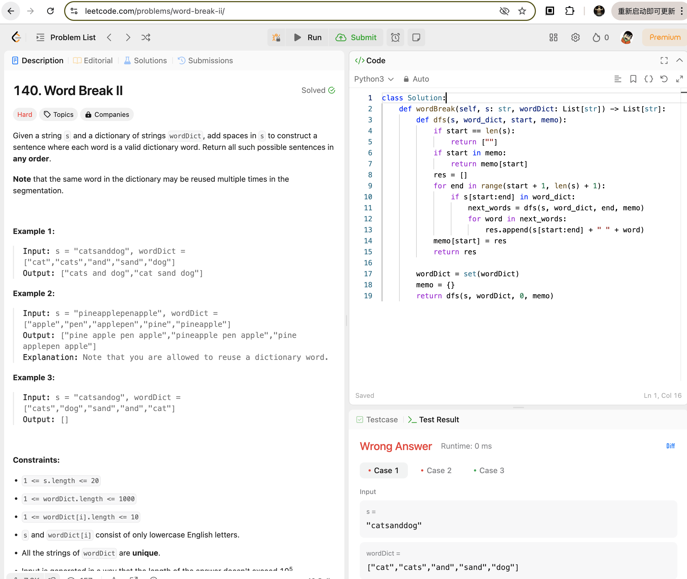

# 探索书生大模型能力边界

# 任务一. InternThinker 挑战 LeetCode

## 1. LeetCode 44 - 字符串通配符匹配

### InternThinker

LeetCode 44 题目，InternThinker通过所有用例测试：

### InternLM

## 2. LeetCode 140 - Word Break II

### InternThinker

代码通过所有测试用例：

### InternLM

将 InternLM 生成的答案

# 任务二. 考倒 InternThinker