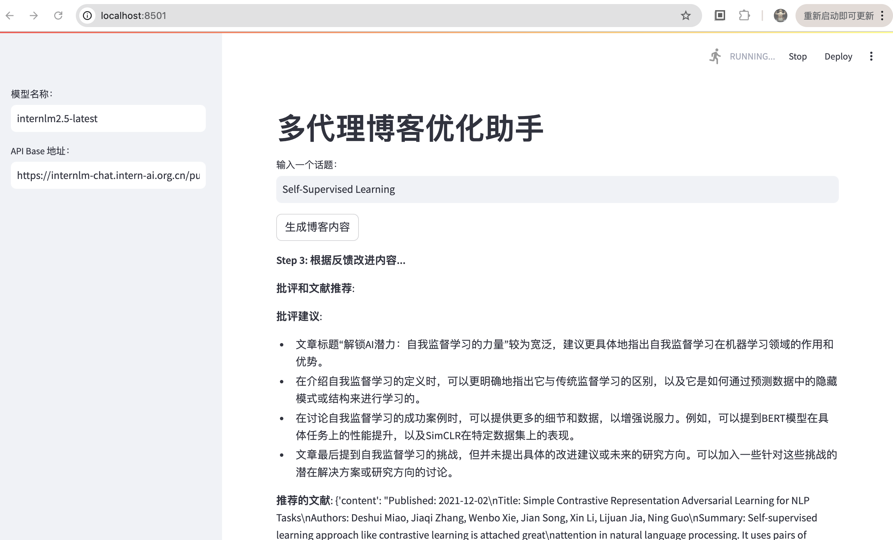

# Lagent：从零搭建你的 Multi-Agent

# 基础任务

## 1. 制作一个属于自己的Agent

### 1.1 安装环境依赖

参照文档新建conda环境，并安装pip包依赖
```shell
conda create -n lagent python=3.10 -y
conda activate lagent
conda install pytorch==2.1.2 torchvision==0.16.2 torchaudio==2.1.2 pytorch-cuda=12.1 -c pytorch -c nvidia -y
pip install termcolor==2.4.0
pip install streamlit==1.39.0
pip install class_registry==2.1.2
pip install datasets==3.1.0
```

### 1.2 代码克隆，安装lagent pip包

克隆lagent相关代码（指定版本）并从源码安装pip包

```
git clone https://github.com/InternLM/lagent.git
cd lagent && git checkout e304e5d && pip install -e . && cd ..
pip install griffe==0.48.0
```


### 1.3 创建lagent天气插件

#### 1.3.1 申请天气查询 API KEY

1. 访问 [和风天气](https://console.qweather.com/)
2. 注册账号
3. 创建项目，并创建 API KEY


#### 1.3.2 创建插件action代码 

1. 在 `lagent/lagent/actions` 目录下创建插件源码 [weather_query.py](actions/weather_query.py)


通过代码知道，插件运行依赖和风API key的环境变量`weather_token`设置

2. 修改目录`lagent/lagent/actions`下的代码 [__init__.py](actions/__init__.py) 注册插件


### 1.4 创建lagent应用源码并执行

1. 在目录`lagent/examples`下创建 [agent_api_demo.py](examples/agent_api_demo.py)


并且通过代码知道应用程序依赖环境变量 `token` 作为模型API token

2. 设置环境变量并执行agent demo

```
export token='...'
export weather_token='...'
cd /root/agent_camp4/lagent/examples
streamlit run agent_api_demo.py
```


3. 设置本地ssh 端口映射，通过浏览器查看运行情况

```shell
ssh -p 42141 root@ssh.intern-ai.org.cn -CNg -L 8501:127.0.0.1:8501 -o StrictHostKeyChecking=no
```


未开启插件：


开启arxiv和天气查询插件，重新再提问两个问题：


验证天气情况，确认答案符合预期


## 2. Multi-Agents博客写作系统的搭建

### 2.1 创建博客写作系统应用代码

沿用前面任务的codna环境，创建新的lagent应用代码 [multi_agents_api_web_demo.py](examples/multi_agents_api_web_demo.py)

### 2.2 执行multi-agents应用

1. 通过 streamlit 运行应用

```shell
cd /root/agent_camp4/lagent/examples
streamlit run multi_agents_api_web_demo.py
```

2. 通过浏览器查看运行结果（需要提前开启ssh端口映射）

step 1. 生成初始内容


step 2. 批评者提供反馈和文献推荐


step 3. 根据反馈改进内容



step 4.生成最终优化的博客内容


完整的优化后内容：

