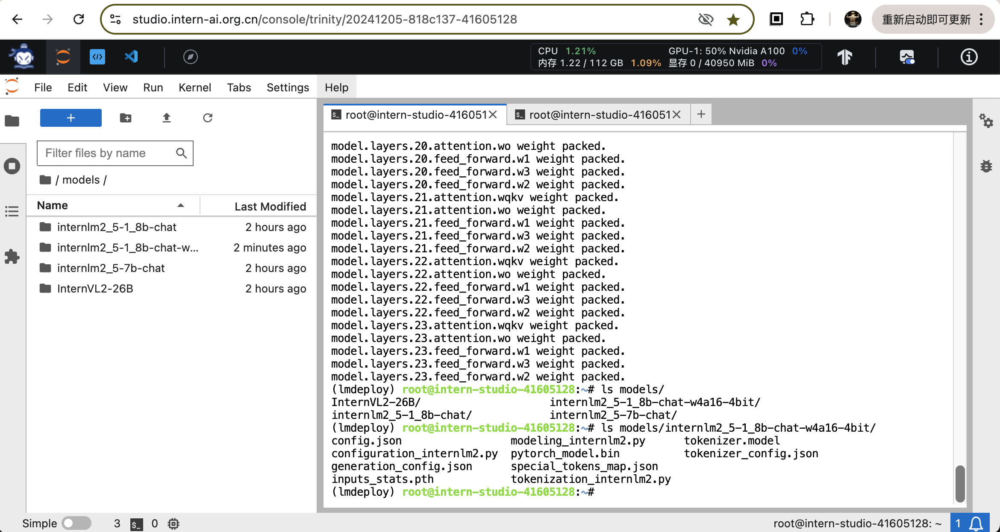
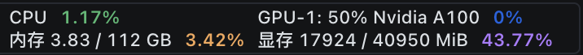
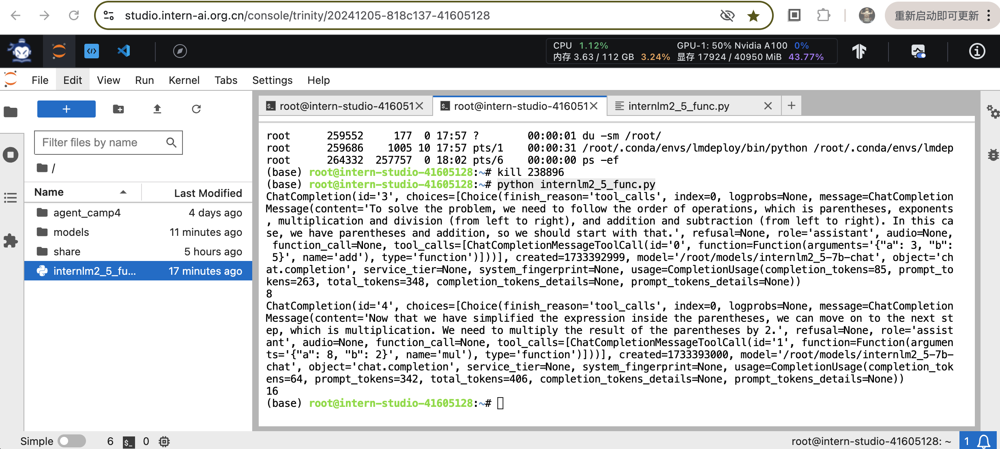

# LMDeploy 量化部署实践闯关任务

## 1. 量化模型部署实践

### 1.1 环境配置

1. 创建开发机（30% A100, 24GB 显存以上环境）

2. 按照lmdeploy所需的依赖配置conda环境

```shell
conda create -n lmdeploy  python=3.10 -y
conda activate lmdeploy
conda install pytorch==2.1.2 torchvision==0.16.2 torchaudio==2.1.2 pytorch-cuda=12.1 -c pytorch -c nvidia -y
pip install timm==1.0.8 openai==1.40.3 lmdeploy[all]==0.5.3
pip install datasets==2.19.2
```

### 1.2 基础模型准备与验证

1. 准备 internlm2_5-1_8b-chat 模型

```shell
mkdir /root/models
ln -s /root/share/new_models/Shanghai_AI_Laboratory/internlm2_5-1_8b-chat /root/models
```

2. 检查模型：通过lmdeploy命令验证 internlm2_5-1_8b-chat

```shell
lmdeploy chat /root/models/internlm2_5-1_8b-chat
```


权重占用3.6GB，余下显存的80%用作KV cache，(40-3.6)*80% = 29.1GB，总共占用 32.7GB


### 1.3 W4A16模型量化与部署

#### 1.3.1 W4A16模型量化

激活保持在16位浮点数，权重量化为int4，对应lmdeploy参数为 `--w-bits 4`

```shell
lmdeploy lite auto_awq \
   /root/models/internlm2_5-1_8b-chat \
  --calib-dataset 'ptb' \
  --calib-samples 128 \
  --calib-seqlen 2048 \
  --w-bits 4 \
  --w-group-size 128 \
  --batch-size 1 \
  --search-scale False \
  --work-dir /root/models/internlm2_5-1_8b-chat-w4a16-4bit
```

执行命令后开始进行模型量化，整个过程在 50% A100 上耗时约40分钟




对比量化前后的模型大小，量化前`internlm2_5-1_8b-chat`模型大小为3.6GB，而量化后的w4a16模型大小为1.5GB


检查量化生成的模型结果，位于路径 `models/internlm2_5-1_8b-chat-w4a16-4bit` 中

#### 1.3.2 W4A16模型量化+KV cache量化部署

1. 验证量化模型的使用
```shell
cd ~
lmdeploy chat models/internlm2_5-1_8b-chat-w4a16-4bit/ --model-format awq
```


2. 以API server的模式部署模型 `internlm2_5-1_8b-chat-w4a16-4bit`，开发机命令如下
```shell
cd ~
lmdeploy serve api_server  models/internlm2_5-1_8b-chat-w4a16-4bit/ \
    --model-format awq \
    --quant-policy 4 \
    --cache-max-entry-count 0.4\
    --server-name 0.0.0.0 \
    --server-port 23333 \
    --tp 1
```
参数中指定了模型的AWQ量化方式，采用4位量化，KV cache指定为使用40%余下显存


观察GPU显存占用情况：1.8B 模型 4位量化后理论权重占用为 0.9GB，KV cache 占用余下显存的 40%，即 (40-0.9)*40% = 15.6GB，总计 16.5GB。符合预期


本机开启SSH 23333端口映射，确认Fastapi部署成功
```shell
ssh -p 36089 root@ssh.intern-ai.org.cn -CNg -L 23333:127.0.0.1:23333 -o StrictHostKeyChecking=no
```

通过浏览器访问验证 http://127.0.0.1:23333


3. 在开发机中启动基于API的交互服务（新tab中运行）
```shell
conda activate lmdeploy
lmdeploy serve api_client http://localhost:23333
```


4. 也可以在开发机中通过gradio启动web交互
```shell
lmdeploy serve gradio http://localhost:23333 \
    --server-name 0.0.0.0 \
    --server-port 6006
```


访问 http://127.0.0.1:6006（本机需要提前开启对6006端口的映射）
```shell
ssh -p 36089 root@ssh.intern-ai.org.cn -CNg -L 6006:127.0.0.1:6006 -o StrictHostKeyChecking=no
```


### 1.4 API 开发

通过应用lmdeploy部署的模型API `http://0.0.0.0:2333` ，可以将该API endpoint当作一个通用的类OpenAI接口调用

1. 创建应用代码 [internlm2_5.py](code/internlm2_5.py)


2. 执行应用代码
```shell
python internlm2_5.py
```


## 2. Function Call 实践

在大模型问答中支持数学加法与乘法

1. 创建python文件 [internlm2_5_func.py](code/internlm2_5_func.py)


2. 在执行脚本前，先通过lmdeploy 以 API server的方式启动模型
```shell
conda activate lmdeploy
# 复用先前量化的模型
lmdeploy serve api_server  models/internlm2_5-1_8b-chat-w4a16-4bit/ \
    --model-format awq \
    --quant-policy 4 \
    --cache-max-entry-count 0.4 \
    --server-name 0.0.0.0 \ 
    --server-port 23333  \
    --tp 1
```

3. 执行包含function call的 python代码
```
python internlm2_5_func.py
```



在输出结果中可以观察到，在执行代码中`Compute (3+5)*2`的提问中，执行了两次 tool_calls：
> ChatCompletionMessageToolCall(id='0', function=Function(arguments='{"a": 3, "b": 5}', name='add'), type='function')

和

> ChatCompletionMessageToolCall(id='1', function=Function(arguments='{"a": 8, "b": 2}', name='mul'), type='function')