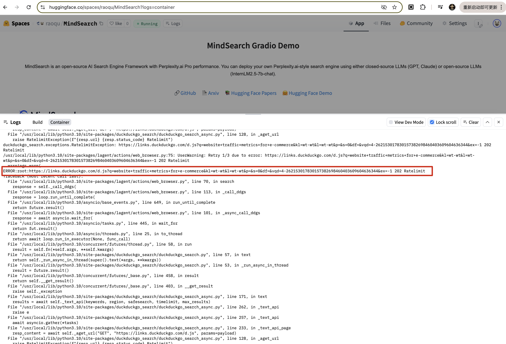
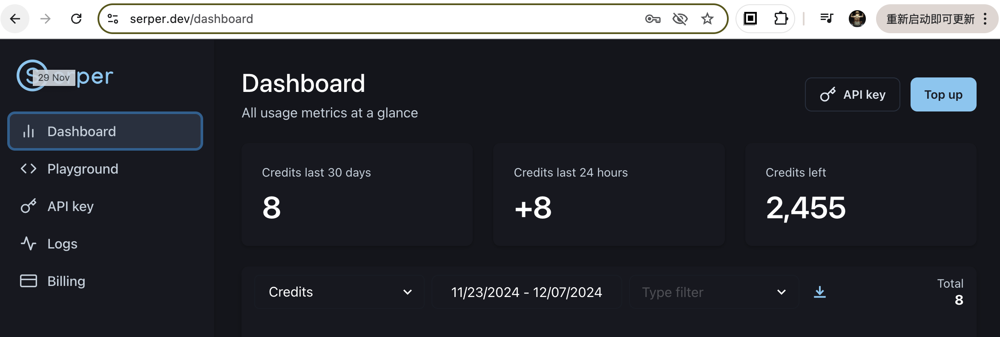

# MindSearch深度解析及实践

# 1. 部署MindSearch到Huggingface

## 1.1 Github codespace
1 在硅基流动上注册API KEY


2. 新建Github codespace

进入[Github codespaces](https://github.com/codespaces)，使用Blank模板创建一个新的sapce

初始化conda环境
```shell
conda create -n mindsearch python=3.10 -y
conda init
source activate base
conda activate mindsearch
git clone https://github.com/InternLM/MindSearch.git && cd MindSearch && git checkout ae5b0c5
pip install -r requirements.txt
```


3. 在codespace中启动应用前后端

3.1 启动后端

在codespace中初始化key并执行后端指令
```shell
export SILICON_API_KEY='.....'
python -m mindsearch.app --lang cn --model_format internlm_silicon --search_engine DuckDuckGoSearch --asy
```


这个时候后端通过 8002 端口暴露出 FastAPI 接口，可以通过在浏览器的codespace映射到8002端口的域名映射进行访问


3.2 启动前端

在codespace新开一个terminal，并输出以下命令启动前端gradio应用
```shell
cd /workspaces/codespaces-blank/MindSearch
conda activate mindsearch
python frontend/mindsearch_gradio.py
```


通过映射到7882的商品的space域名访问应用进行测试


## 1.2 Huggingface space 部署

### 1.2.1 Huggingface space 部署及试运行

从InternLM的官方MindSearch Space(https://huggingface.co/spaces/internlm/MindSearch)复制出一个新的Space


等待Huggingface space部署过程，过程耗时较长，需耐心等待


完成自己的 [Hugginface Space](https://huggingface.co/spaces/raoqu/MindSearch) 部署

在运行过程中会发现任务执行很容易失败


### 1.2.2 问题排查与修复

这个时候，通过观察huggingface space的 Logs 查看出现错误的原因，会发现大量的io超时

再向上追溯，会发现duckduckgo的限速异常



为了解决这个问题，将代码clone到本地进行验证，调试会更方便一些

```shell
git clone https://huggingface.co/spaces/raoqu/MindSearch
conda create --n ai python=3.10 -y
conda activate ai
export SILICON_API_KEY = '...'
python app.py
```

通过查看代码可以看到 app.py 中实际上是通过 `os.system` 启动了后端代码，然后并行用gradio启动前端服务

并且代码中指定了搜索引擎使用的是 DuckDuckGoSearch


这时候本地启动也会出现与 Huggingface 上相同的问题，通过代码可以查看可选的搜索引擎还有 Bing、Brave、Google和腾讯的搜索服务。可以看到除了DuckDuckGo以外，其他的搜索引擎都需要申请相应的API key


这时候选择改成Google作为搜索引擎，新注册的Serper用户会有一些免费的API调用额度，访问[Serper](https://serper.dev/)


以前已经注册过，可以利用serper的key，如果没有在页面中新建就可以了


修改代码中的搜索引擎参数为 `GoogleSearch`


根据代码里的映射关系，重新设置环境变量`GOOGLE_SERPER_API_KEY`，重新运行发现仍然会报403异常

再仔细分析代码，会发现后端应用代码中的片断，依赖的是另外一个环境变量 `WEB_SEARCH_API_KEY`


添加环境变量，重新运行，本地运行成功
```shell
export WEB_SEARCH_API_KEY='替换成自己的Serper API key'
```


通过seper页面，可以观察知道，在刚刚的 MindSearch 运行中进行了 8 次搜索调用



### 1.2.3 重新部署Huggingface Space

由于添加了对Serper的依赖，因此需要为Huggingface Space添加新的环境变量`WEB_SEARCH_API_KEY` 和 `GOOGLE_SERPER_API_KEY`(New Secret)


通过Git 提交代码并push到Huggingface代码仓库
```shell
cd MindSearch
git add app.py
git commit -m "Change search engine"
git push
```

重新访问 [Huggingface Space](https://huggingface.co/spaces/raoqu/MindSearch)，应用会触发重新部署

等待部署完成后重试应用，会发现应用能够正常运行了


# 2. 部署Streamlit版本到Huggingface